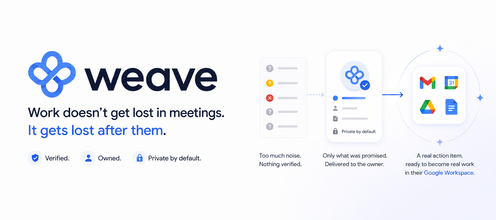

<p align="center">
  
</p>

<h1 align="center">Weave</h1>

<p align="center">
  <strong>Every commitment from every meeting — found, verified, and routed to the one person who owns it.</strong>
</p>

<p align="center">
  <a href="docs/README.md">Documentation</a> ·
  <a href="docs/product/overview.md">Overview</a> ·
  <a href="docs/product/features.md">Features</a> ·
  <a href="docs/ARCHITECTURE.md">Architecture</a> ·
  <a href="docs/DEPLOYMENT.md">Deployment</a> ·
  <a href="docs/product/roadmap.md">Roadmap</a>
</p>

---

Knowledge work has reorganised itself around the meeting. A senior engineer, a product
manager, a team lead — each now spends most of the week in calls, and each call ends the same
way: with obligations distributed across the people who attended, recorded nowhere anybody
will look again.

Weave closes that gap. It reads the transcripts Google Workspace already produces, keeps the
commitments people genuinely made, gives each one to the person who accepted it, remembers it
across every meeting it reappears in, and answers the question that actually matters:
**what should I do first, and why?**

> **Work doesn't get lost in meetings. It gets lost after them.**

## How it works

```
Google Meet  →  Pub/Sub  →  Cloud Run  →  Agent Engine  →  Firestore  →  You
 transcript      event      screening      two-phase       commitment    one Google Chat
                                            pipeline          graph      direct message
```

A meeting ends and each attendee's own transcript subscription fires. Ingestion reads the
transcript **as that person**, screens it, and hands it to a two-phase agent pipeline.
**Phase one** reads the whole room and keeps only what somebody explicitly accepted — or was
explicitly handed — with the turn that proves it. **Phase two** runs once per owner, in a
private session as that owner, enriching only their items with only context they can already
open. Results are reconciled into a personal commitment graph and delivered as a card in that
person's Weave direct message.

Nobody installs anything but a Chat app they add themselves. No bot joins the call.

## What makes it trustworthy

**A promise is not an assignment.** When someone says *"Alex, can you prepare the rollout
checklist?"*, nothing has been promised yet. Weave keeps an item only when it was accepted
out loud or explicitly handed to a new owner who accepted it — and an accepted item is
*required* to carry the turn where that acceptance happened. Silence stays silence. This one
rule is what makes the output worth acting on without re-reading the transcript.

**One private session per person.** Enrichment runs once per owner, in a fresh session, as
that owner, over only their items. Isolation is a property of the architecture rather than an
instruction in a prompt, and every search carries the owner's access rights *inside the
query*, so the database can only return what they could already open.

**Memory that spans meetings.** A deliverable raised on the 12th, restated on the 19th and
carried again on the 28th is one commitment with a three-week history — not three tasks in
three tools. The pattern becomes visible exactly when it becomes a risk.

**Priority you can argue with.** *"Confirm the rollback plan — it's 3 days overdue and three
commitments are queued behind it."* Ordering is arithmetic over stated facts: deadlines,
blocking impact, staleness, carry-over. Dependencies come only from preconditions people
actually spoke, because a guessed dependency corrupts the very answer the graph exists to
give.

**Identity from the platform, always.** Owners are resolved against the real attendee list
with a confidence floor. Every Meet read impersonates the person whose subscription produced
the event, because a conference record is visible to nobody else. Weave reads *as you*, writes
only its own record, and can always show you the sentence a claim came from.

## What you can do with it

| | |
|---|---|
| **Add Weave and be done** | Send it one message in Chat; your subscription is provisioned for you |
| **Get your card after every meeting** | The agenda, your items, and a button on each one |
| **Ask what to do next** | *"What should I work on first?"* — with the reason attached |
| **Catch up on a day of meetings** | *"What came out of my meetings today?"* |
| **Find a decision** | *"What did we decide about the migration?"* |
| **See what is stuck** | *"What's blocking me?"* — the full chain, not just the first link |
| **Notice what went quiet** | Commitments nobody has mentioned in two weeks surface on their own |
| **Close things by talking** | *"The migration guide is done."* — confirmed, then closed |

One direct message carries all of it: the install that onboards you, the card after each
meeting, and the copilot that answers — all reading the same judgement function, so they can
never disagree.

[**See where this changes the day, by function →**](docs/product/scenarios.md)

## Security posture

Weave handles meeting transcripts and personal Workspace context, and the design assumes it.

- **Read-only by construction.** Every Workspace scope it holds is `readonly`, and there is no
  write path into Drive, Tasks or Calendar. Weave writes only its own derived record, so
  adopting it changes what people *know*, never what anything can *reach*.
- **Scoped to one person, always.** Every context read executes as that individual, against
  material already visible to them, with access rights enforced as a query predicate.
- **No delegation on the agent runtime.** Agent Engine holds none, ever; delegated reads go
  through an authenticated broker on ingestion that refuses anyone who is not onboarded.
- **Transcripts screened on the way in, answers on the way out**, with prompt-injection and
  sensitive-data protection through Model Armor.
- **265 hermetic tests** — no network, no cloud credentials, no model calls — pinning every
  safety property, so each one holds under any input.

[**Read the full security model →**](docs/engineering/security.md)

## Quick start

```bash
uv python install 3.12
make install
make lint
make test          # 265 hermetic tests
make demo          # run the whole pipeline on a bundled transcript
```

The local foundation — contracts, both agents, the context framework, the delivery contract —
runs with no cloud dependencies at all, so the entire pipeline is exercisable before any
Workspace integration exists. Model-backed evaluation is kept separate; set `GOOGLE_API_KEY`
or the Vertex variables in `.env.example` before `make eval`.

Deploying it for real: [**deployment guide**](docs/DEPLOYMENT.md) for the assisted
walkthrough, [`infra/SETUP.md`](infra/SETUP.md) for the Terraform specifics and the full table
of traps.

## Documentation

| | |
|---|---|
| 🎯 **Product** | [Overview](docs/product/overview.md) · [Features](docs/product/features.md) · [Scenarios](docs/product/scenarios.md) · [Roadmap](docs/product/roadmap.md) |
| ⚙️ **Engineering** | [Architecture](docs/ARCHITECTURE.md) · [Security](docs/engineering/security.md) · [Data model](docs/engineering/data-model.md) |
| 🚀 **Operations** | [Deployment](docs/DEPLOYMENT.md) · [Running Weave](docs/operations/running.md) · [`infra/SETUP.md`](infra/SETUP.md) |

## Where Weave goes next

**Per-user OAuth consent.** Move delegated Workspace access to consent granted explicitly by
each individual at onboarding. Every person authorises exactly the scopes they choose, sees
what they granted, and can withdraw it themselves at any time — so Weave's reach becomes the
union of individual, revocable consents. The seam already exists: `SearchPrincipal` carries a
credential reference and the broker resolves credentials per subject.

**Anticipatory, self-healing meeting discovery.** Anchor discovery to the calendar, so Weave
knows which meetings are coming, who was invited, and what the agenda says — which sharpens
extraction, lets context be pre-staged, and turns *no transcript* into a known state rather
than silence. Combine that with a second Drive-side signal and a watermark reconciliation
sweep, and discovery stops depending on any single channel: every gap closes itself on the
next pass, because every identifier is deterministic and every write is replay-safe.

**Gemini Enterprise as a second surface.** The copilot is already a separate Agent Engine
deployment that takes its principal from the platform, so registering it is verification work
rather than code — and Weave fails closed either way: an unmapped identity yields a useless
agent, never a leaky one.

**An open ecosystem of context sources.** Enrichment already fans out across a registry where
a source is one subclass and one config entry. This prototype ships four Google Workspace
sources deliberately, to prove the isolation model on one identity system — the same interface
opens directly onto OAuth providers such as Jira, Confluence, GitHub, Linear, Notion and
Slack, and onto API-key and service-token systems like internal wikis and search indexes.
Commitments then arrive with the ticket they belong to and the page that specifies them, still
filtered to what their owner can already see.

**Live mode — Weave in the room.** With the explicit consent of everyone present, Weave can
join the meeting itself. It can confirm a commitment while everyone is still there — *"Alex,
is the rollout checklist yours?"* — turning the single biggest source of dropped work into one
sentence. It can answer questions during the call from the same owner-scoped sources, so *"what
did we decide about the vendor numbers?"* is resolved in the meeting rather than in a follow-up
to it. And the summary, commitments and graph are built as the conversation happens, so the
work is routed the moment the call ends. Consent is the feature: Weave joins only where
everyone agreed, and its presence is something the room chose.

[**Read the full roadmap →**](docs/product/roadmap.md)
