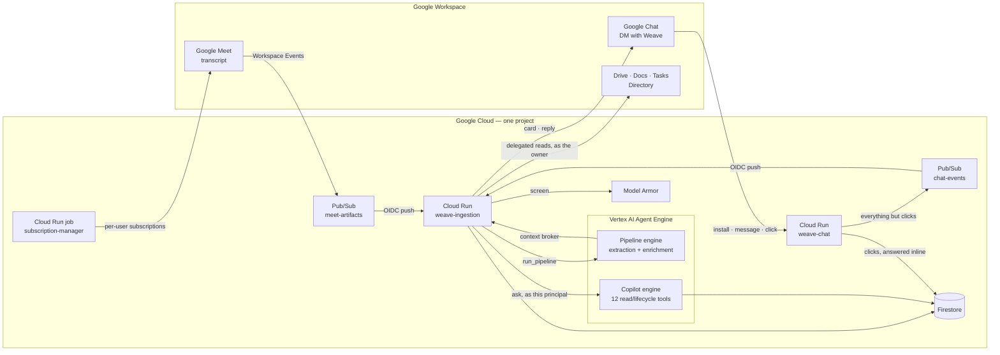
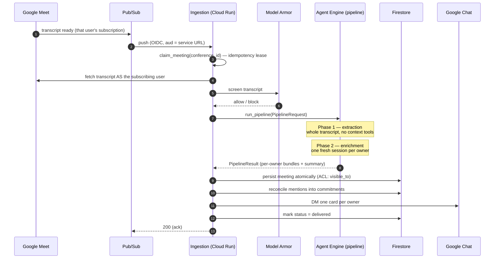
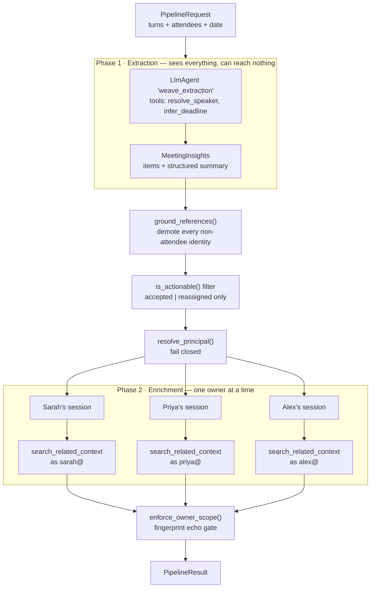
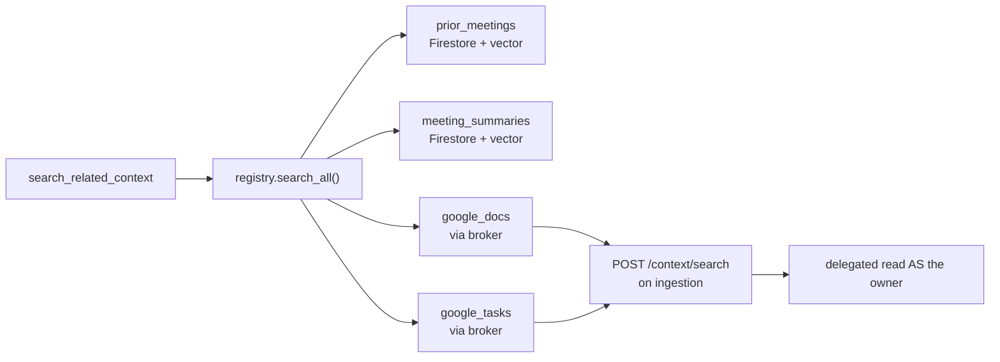
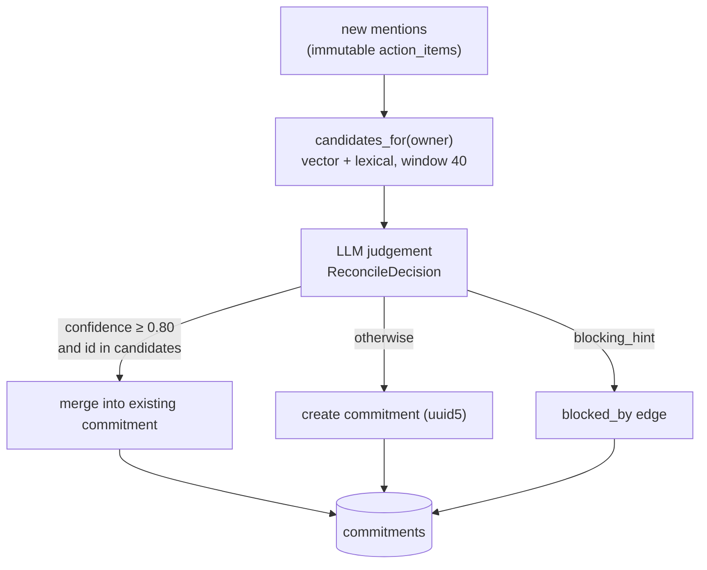
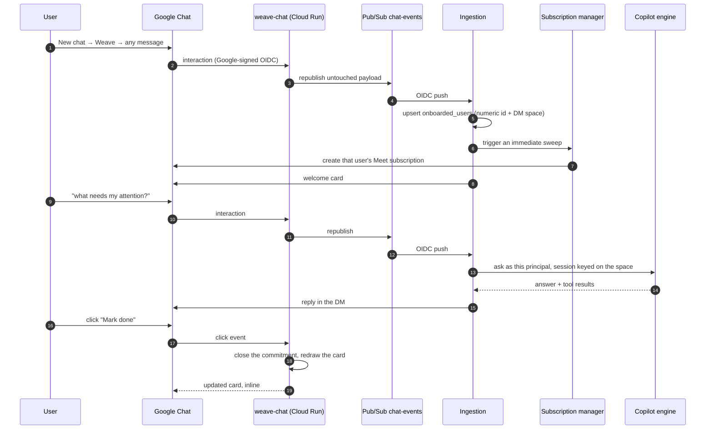

# Architecture

How Weave is put together, and — just as importantly — why it is put together this way.
Every structural choice below exists to protect one of four properties: that a commitment
is real, that it belongs to exactly one person, that nobody can see anybody else's work,
and that the system can explain itself.

- [Design decisions and rationale](#design-decisions-and-rationale) — the choices, and what each one buys
- [System at a glance](#system-at-a-glance) · [End-to-end flow](#the-end-to-end-flow)
- [The two-phase agent pipeline](#the-two-phase-agent-pipeline) — the core of the design
- [Context framework](#the-context-framework) · [Commitment graph](#the-commitment-graph) · [Prioritisation](#prioritisation)
- [The Google Chat surface](#the-google-chat-surface) — onboarding, cards, conversation
- [Deployment topology](#deployment-topology) · [Package layout](#package-layout)

Related reading: [Security model](engineering/security.md) for the invariants and how they
are enforced, [Data model](engineering/data-model.md) for collections and indexes, and
[Deployment](DEPLOYMENT.md) for standing it all up.

## Design decisions and rationale

Seven decisions shape everything else. Each is stated with the alternative it was chosen
over, because a decision without a discarded alternative is just a description.

### 1 · Split the pipeline in two, and make the split a capability boundary

**Decision.** Extraction reads the entire transcript and holds *no* context tools.
Enrichment holds the context tool and runs once per owner, in a fresh session, as that
owner.

**Instead of.** One agent that reads the transcript and looks things up as it goes.

**Why.** A single agent would, at one moment, hold both everybody's words and the ability
to search somebody's private files. That is precisely the combination that leaks. Splitting
the phases means no single reasoning step ever holds both capabilities, so isolation stops
depending on the model behaving and becomes a property of the wiring. It costs an extra
model round trip per owner; that is a price worth paying for a guarantee that survives
adversarial input.

### 2 · Enforce product invariants in Python, never in a prompt

**Decision.** "Only accepted work counts", "an accepted item must cite its turn", "results
must belong to the owner" are pydantic validators and explicit filters. The prompt explains
them; the code enforces them.

**Instead of.** Careful prompt instructions plus trust in the model.

**Why.** A prompt is guidance that degrades under unusual or adversarial input; a validator
holds for every input, including ones nobody imagined. It also makes the rules reviewable
and testable — each invariant has a named test — rather than buried in prose. If a rule can
only be expressed in a prompt string, it is not yet a rule.

### 3 · Take identity from the Meet API, and fail closed

**Decision.** Owners resolve against the real attendee list with a confidence floor.
Below it — or for anyone who was not actually in the meeting — the owner gets an unenriched
bundle and **no search at all**.

**Instead of.** Trusting the name the model returned, or falling back to a best guess.

**Why.** A model asked "who is Sarah?" always produces a plausible answer. Acting on a
wrong one routes a person's work *and* their private context to somebody else — the worst
failure the system can have. Refusing to enrich is a visible, harmless degradation;
guessing is an invisible, harmful one.

### 4 · Put access rights inside the query, not around it

**Decision.** Every context read carries the principal's ACL as a query predicate
(`visible_to array_contains <email>`), so the database itself cannot return anything else.

**Instead of.** Fetching results and filtering them afterwards in application code.

**Why.** Post-filtering is one forgotten branch away from a leak, and the unfiltered rows
exist in memory in the meantime. A predicate cannot be forgotten: a query without it
returns nothing rather than everything. The echo gate then re-checks the returned set as a
second, independent layer.

### 5 · Derive dependencies only from preconditions people actually spoke

**Decision.** A `blocked_by` edge exists only where somebody stated the precondition out
loud. Topical similarity never creates one.

**Instead of.** Inferring dependencies from semantic similarity between items.

**Why.** The graph exists to answer "what should I do first". A guessed edge corrupts
exactly that answer, and does it invisibly — the ordering still looks confident. Fewer,
true edges beat more, plausible ones, and every edge can be traced to a sentence.

### 6 · Read-only by construction, with no write path at all

**Decision.** There is no tool anywhere in the agent surface that writes to Drive, Tasks,
Calendar or any other work system. Weave writes only its own derived records.

**Instead of.** Write access that is disabled by configuration or guarded by a permission
check.

**Why.** This is the entire prompt-injection story. A transcript is untrusted text written
by whoever was in the room. With no write capability in the process, the best outcome for a
malicious transcript is a bad suggestion on a card a human reads. Absent beats disabled: a
capability that does not exist cannot be re-enabled by a mistake.

### 7 · Deliver into the conversation people already have

**Decision.** Weave has no application of its own. It lives in a Google Chat direct
message: the same DM carries the install that onboards you, the card after each meeting,
and the copilot you ask questions of.

**Instead of.** A Weave dashboard, inbox or task board.

**Why.** The problem is that people have too many demands on their attention; a tool that
adds another destination to check would work against its own purpose. Putting delivery and
conversation in one DM also means the card and the answer are drawn from the identical
judgement function, so they can never disagree about the facts — which would be worse than
either being absent.

### Consequences worth naming

Good architecture is honest about what it trades away.

| Choice | What it costs |
|---|---|
| Two phases | An extra model call per owner, and a fan-out to orchestrate |
| Fail-closed identity | Some legitimate owners get an unenriched bundle rather than a guess |
| Spoken preconditions only | Real dependencies nobody articulated are not in the graph |
| No write path | Weave can tell you what you owe; closing the loop stays in your own tools |
| DM-only delivery | Nothing is posted to a shared space, so there is no team view |
| One project, no shared state | No cross-tenant view, and no organisation-wide reporting |

Each of these is a deliberate floor, not an oversight. Where a future direction lifts one,
it is described in the [roadmap](product/roadmap.md).

## System at a glance

Everything lives in **one GCP project**. There is no shared state outside it, and deleting
the project removes the entire system.

## The end-to-end flow

Failure semantics are deliberate: a **200** acks the message (processed, duplicate,
malformed, or blocked — all terminal), while a **500** leaves it for Pub/Sub to redeliver.
Anything unretryable is acked so it cannot poison the subscription.

The Meet fetch impersonates **the user whose subscription produced the event**, read from
the CloudEvent subject. A conference record is visible only to that conference's
participants, so a single fixed subject would restrict the system to one person's meetings;
when the subscriber cannot be determined the event fails with the full attribute set logged
rather than reading as the wrong account.

## The two-phase agent pipeline

This is the core of the design, and the split is a security boundary before it is an
engineering one.

### Phase 1 — extraction

One `LlmAgent` reads the entire transcript. Its tool list is the whole point:

| Tool | Purpose |
|---|---|
| `resolve_speaker` | Match a participant ID or spoken name against **trusted Meet attendee state**, returning an email and a confidence. Exact participant ID → 1.0; exact display name → 0.95; fuzzy first/full name → score × 0.9; ambiguous → 0.0 and no email. |
| `infer_deadline` | Turn a spoken phrase into a date relative to the meeting date, or nothing. |

There is **no context tool here at all**, and that is asserted by
`test_extraction_agent_has_no_context_tools`. The agent that sees everyone's words has no
ability to reach anyone's files, so there is no path by which one attendee's private
context could enter a shared reasoning step.

Extraction also produces the meeting's structured summary — overview, topics, decisions,
implementation notes, reproduction steps — bounded by the schema and required to be
transcript-grounded.

### Between the phases — the trust re-grounding

Three pure functions run before any owner-scoped work begins:

1. **`ground_references`** — every person-reference the model resolved is checked against
   the real Meet attendee list. Anything not present, or below the 0.85 confidence floor,
   is demoted to `status="unknown"` with its identity fields cleared. The spoken mention and
   turn index are kept, so provenance survives even when identity does not.
2. **`is_actionable()` filter** — only `accepted` and `reassigned` items with a real owner
   continue. Everything else is counted into `dropped_item_count`.
3. **`resolve_principal`** — fails closed on three distinct grounds: no email, confidence
   below the floor, or an owner who is not an actual attendee. Each produces an *unenriched
   bundle carrying its reason* — never a search.

### Phase 2 — enrichment

For each owner, a **fresh `InMemoryRunner` session** is created with `user_id` set to that
owner's email, and session state containing *only* that owner's items. The agent has
exactly one tool, `search_related_context`, which is read-only and constrained to the
session's `search_principal`.

Isolation here is structural. It is not a prompt asking the model to stay in its lane — it
is a separate session that has never been shown anyone else's data.
`test_enrichment_session_state_contains_only_owner_items` pins it.

### The echo gate

A model asked to return items back can quietly reword, duplicate, drop, or re-own them.
`enforce_owner_scope` refuses to trust the echo: every returned item is SHA-256
fingerprinted against the exact inputs, with multiplicity preserved. Only exact matches are
accepted, and only the **original** item is kept — the model's copy is discarded and only
its additive fields (`title`, `details`, `matches`) survive.

If every item fails the gate, the owner gets an unenriched bundle with
`skip_reason="enrichment_echo_mismatch"` rather than a silently corrupted card.

## The context framework

Enrichment's single tool fans out across a registry of owner-scoped sources.

| Source | Auth mode | Backend | ACL enforcement |
|---|---|---|---|
| `prior_meetings` | `USER_CONTEXT` | Firestore `action_items` | `visible_to array_contains principal` **inside the query** |
| `meeting_summaries` | `USER_CONTEXT` | Firestore `meeting_summaries` | same, plus the current meeting excluded from its own context |
| `google_docs` | `USER_CONTEXT` | Drive, via the ingestion broker | delegated read impersonating the owner |
| `google_tasks` | `USER_CONTEXT` | Tasks, via the ingestion broker | delegated read impersonating the owner |

Four properties are load-bearing:

- **The ACL is a query predicate, not a post-filter.** Firestore never returns a document
  the principal cannot see, so a bug in ranking cannot become a disclosure.
- **`SERVICE_ONLY` sources are dropped unless explicitly allowed.** `allow_service_only`
  defaults to `False`; a source that cannot be scoped to a user never serves a user query.
  Pinned by `test_service_only_results_never_reach_the_caller`.
- **Unknown source names fail at build time**, not query time — a typo in config is a
  startup error, not a silent hole.
- **Source failures are contained.** `search_all` catches per source; one dead backend
  costs its own results and nothing else.

### The context broker

Agent Engine has **no domain-wide delegation, ever**. When enrichment needs a Drive file or
a Google Task, it calls `POST /context/search` on ingestion with an OIDC token. Ingestion —
the only identity holding broad DWD — performs the delegated read *as the owner* and
returns matches.

The broker refuses a subject who is not onboarded, clamps the limit, truncates the query,
rejects unknown sources, and **never logs the query text** (Google API errors can embed the
request URL, so only the exception type is recorded). This keeps the blast radius of the
agent runtime to zero delegated capability.

### Retrieval strategy

Both Firestore-backed sources use the same shape: **recency decides what enters the
candidate window, relevance decides what leaves it.** A 40-document window is pulled under
the ACL, ranked by vector similarity where embeddings exist, and falls back to IDF-weighted
lexical cosine (`weave_common.relevance`) when the vector index or embedder is unavailable.
The fallback keeps search *available* — but a missing `embedding` field makes a document
invisible to vector search, which is why backfill is a required rollout step and not
optional cleanup.

## The commitment graph

Reconciliation runs in ingestion after persistence, converting immutable mentions into an
owner-scoped graph.

The judgement returns a structured `ReconcileDecision`: matched id, confidence,
relationship (`original` / `restated` / `carried_over` / `progress_evidence` /
`completion_evidence`), canonical title, inferred state, evidence, `waiting_on`, and
`blocking_hint`.

Three guards make it safe:

- **Thresholds and membership are enforced in Python**, not trusted from the model. A match
  needs `confidence ≥ 0.80` *and* an id that was actually in the candidate list.
- **Edges require a stated precondition.** `blocking_hint` is only honoured when the mention
  itself says the work cannot proceed until something else is done. A hint naming a
  candidate outright is honoured directly; a hint naming something else is resolved by
  similarity at `≥ 0.80` or dropped. Shared topic, project, or person creates nothing.
- **The judgement reads more than the description.** `judgement_text` assembles the tidied
  description *plus* the stated precondition, the spoken source text, and the enrichment
  details — because a dependency usually survives in the spoken words and is paraphrased
  out of the description. Judging on the description alone is why the graph originally had
  no edges at all.

The whole fold is one transaction over three documents — the commitment, the mention
beneath it, and the action item's back-link — so a crash can never leave a commitment whose
mention count disagrees with its mentions. Replaying a mention is a no-op.

`likely_complete` may be inferred from completion evidence; `closed` never is. Only a human
closes a commitment.

## Prioritisation

`shared/weave_common/commitment_view.py` is presentation-neutral and shared by every
surface, so a Chat card and a copilot sentence state the same facts for the same reasons.

**Urgency group** (declaration order is display order): `overdue` → `due_soon` → `blocking`
→ `waiting` → `stale` → `active` → `likely_complete` → `closed`.

**Attention score**, which ranks *within* a group:

| Signal | Contribution |
|---|---|
| Transitive open dependents | `× 200` each |
| Overdue | `+1000` + days late (capped 365) |
| Waiting ≥ 7 days | `+500` + days since last mention |
| Open | `+10 ×` mention count (capped at 50 mentions) |
| Likely complete | `−50` |

The ratio is a product judgement stated once, in code: roughly five unblocked commitments
equal one missed deadline. Change it there and every surface follows.

Each row is decorated with an `urgency_label`, a `reason` (why it surfaced), a
`recommendation` (what to do — which differs, because "finish it" is useless advice for
blocked work), `blocked_by_titles`, `open_dependents`, and `carry_over`. The copilot is
instructed to *report* these strings rather than compose its own rationale.

Every optional field is `None` when the underlying fact is absent, deliberately: "show it
only when relevant" is a property of the data, not a rule each renderer must remember. A row
with no deadline can never be described as overdue.

## The Google Chat surface

One direct message carries the entire product: enrolment, delivery, and conversation.

Three details are load-bearing:

- **Clicks are answered by `weave-chat` itself; everything else is republished.** Chat's
  interaction deadline is far shorter than a copilot turn, so `weave-chat` handles what it
  can synchronously and hands the untouched payload to ingestion for the rest. That also
  makes the surface reversible: pointing the Chat app's connection back at the Pub/Sub topic
  restores the previous behaviour with no redeploy.
- **The click payload carries a user id, never an address.** `weave-chat` looks the address
  up in `onboarded_users`, so a forged body cannot name somebody else's commitments — and
  every commitment read and lifecycle write is owner-guarded besides.
- **A card is redrawn from stored state.** After a close, the buttons that were rendered
  (`rendered_ids`) are re-read by id under the owner guard and re-rendered, so the card can
  never assert something the record does not carry.

Cards are DM-only by construction: `Join spaces and group conversations` stays off, which
is also why a direct-message install arrives as a `MESSAGE` event — the onboarding signal
the handler acts on.

## Ingestion service surface

| Endpoint | Caller | Auth |
|---|---|---|
| `POST /pubsub-push` | Pub/Sub (`meet-artifacts`) | OIDC, `aud` = service URL, verified SA |
| `POST /context/search` | Agent Engine | OIDC from the agent SA |
| `POST /chat-events` | Chat events topic | OIDC from the push SA |
| `GET /healthz` | anyone | none |

Cloud Run only accepts an OIDC `aud` equal to the service URL, which is why
`custom_audiences` is declared on the service — without it, push 401s at the platform layer
and never reaches the container.

## Transcript ingestion routes

`MeetArtifactSource` is a seam with two implementations, chosen by `artifact_source`:

| Mode | Source | Requirements |
|---|---|---|
| `live` | Meet REST API v2, read as the subscribing user | DWD + the org-policy exception |
| `fixture` | Bundled JSON under `services/ingestion/fixtures/` | none beyond the project |

`fixture` exists so the deployed pipeline can be exercised end to end — screening,
extraction, ACLs, reconciliation, delivery — before any Workspace wiring exists, and so a
smoke test after every rollout costs one `gcloud pubsub topics publish`.

In `live` mode the meeting's **agenda-like title** comes from the transcript document's
Drive filename. That read is best-effort: a participant may not be able to open an
organiser-owned document, in which case the card keeps the meeting time and omits the
title. No extra scope is needed — `drive.readonly` is already granted for context search.

## Deployment topology

| Component | Runtime | Identity | Notable |
|---|---|---|---|
| `weave-ingestion` | Cloud Run | `weave-ingestion-sa` | **The only identity with broad domain-wide delegation** |
| `weave-chat` | Cloud Run (public) | `weave-chat-sa` | Answers card clicks inline; no delegation |
| `weave-subscription-manager` | Cloud Run job + Scheduler | `weave-subscriptions-sa` | DWD for the Meet scope only |
| Pipeline engine | Agent Engine | `weave-agent-sa` | **No delegation, ever** |
| Copilot engine | Agent Engine | `weave-agent-sa` | Same runtime identity, separate deployment |

Keyless DWD throughout: service accounts sign their own delegation assertions via the IAM
Credentials API (`roles/iam.serviceAccountTokenCreator` on themselves) rather than carrying
exported private keys.

Both engines are deployed by `make deploy-agent` and `make deploy-copilot`, which update the
existing deployment so the resource name stays stable for everything that references it.

## Package layout

| Package | Depends on | Role |
|---|---|---|
| `weave_common` | pydantic only | The contract. Importable everywhere, including inside Agent Engine. Nothing heavy, ever. |
| `agent` | `weave_common`, `google-adk` | Agents, prompts, tools, context sources, identity, deployment |
| `weave_ingestion` | `weave_common`, Google APIs | Pipeline handler, broker, persistence, reconciliation, delivery, Chat events |
| `weave_chat` | `weave_common`, `weave_ingestion` | Chat interaction endpoint and inline card actions |
| `weave_subscriptions` | `weave_ingestion` | Subscription lifecycle job |

Cross-package data always crosses as a `weave_common` pydantic model — never an ad-hoc
dict. Most models are `frozen=True, extra="forbid"`, so an unexpected field is an error at
the boundary rather than a surprise three layers in.
