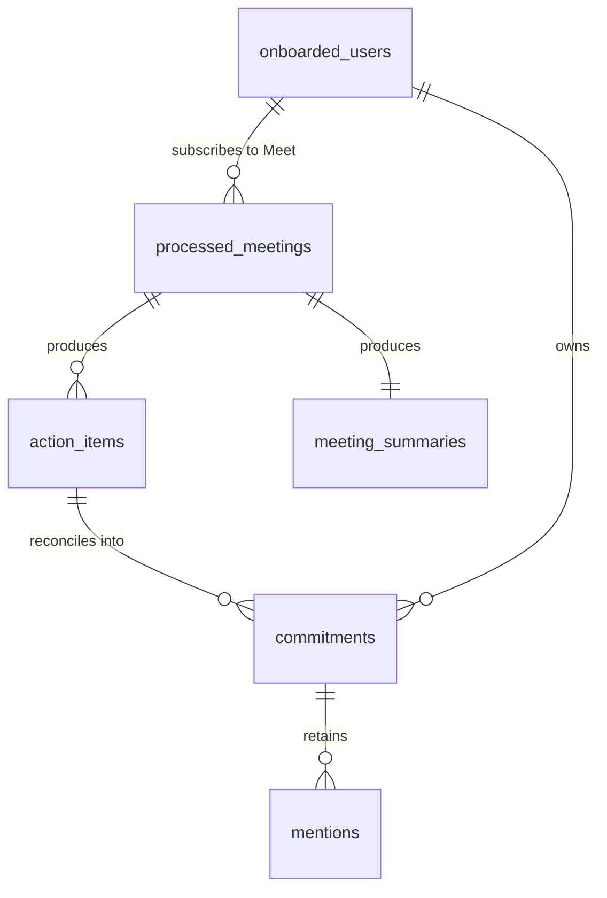

# Data model

Everything Weave persists lives in one Firestore database in one project. This document is
the reference for what is stored, how it is keyed, how it is indexed, and why every write is
safe to replay.

## The contract layer

Cross-package data always crosses as a `weave_common` pydantic model — never an ad-hoc dict.
Most are `frozen=True, extra="forbid"`, so an unexpected field is an error at the boundary
rather than a surprise three layers in.

`weave_common` depends on **pydantic and nothing else**, deliberately: it must stay
importable everywhere, including inside Agent Engine.

### Enumerations

| Enum | Values | Notes |
|---|---|---|
| `CommitmentStatus` | `accepted` · `declined` · `deferred` · `reassigned` · `unresolved` | What the transcript resolved. **Silence is always `unresolved`.** |
| `ACTIONABLE_STATUSES` | `{accepted, reassigned}` | A module-level frozenset — the **only** definition in the codebase; everything imports it. |
| `CommitmentState` | `open` · `waiting` · `likely_complete` · `closed` | Human-controlled lifecycle of a derived commitment. `closed` is never inferred. |
| `MentionRelationship` | `original` · `restated` · `carried_over` · `progress_evidence` · `completion_evidence` | How a mention relates to its commitment. |
| `ActionType` | `task` · `follow_up` · `decision_needed` | Deliberately small; extended only when an eval case demands it. |
| `MatchType` | `existing_prior_item` · `meeting_summary` · `related_discussion` · `related_document` · `open_task` · `none` | Provenance of a context match. |
| `ReferenceStatus` | `resolved` · `unknown` | An identity is complete or it is not. |
| `UrgencyGroup` | `overdue` · `due_soon` · `blocking` · `waiting` · `stale` · `active` · `likely_complete` · `closed` | **Declaration order is display order.** |

### Constants

| Constant | Value | Meaning |
|---|---|---|
| `IDENTITY_CONFIDENCE_FLOOR` | `0.85` | Below this, an identity is not usable |
| `MATCH_THRESHOLD` | `0.80` | Minimum confidence to merge a mention into a commitment |
| `BLOCKER_THRESHOLD` | `0.80` | Minimum similarity to resolve a blocking hint to a commitment |
| `DUE_SOON_DAYS` | `3` | Deadline horizon for `due_soon` |
| `STALE_DAYS` | `14` | Silence before a commitment is "going quiet" |
| `WAITING_ATTENTION_DAYS` | `7` | Waiting this long starts contributing to the score |
| `CANDIDATE_WINDOW` | `40` | Documents pulled by recency before ranking |
| `DIMENSIONS` | `768` | Embedding width |

### Core models

**`ActionItem`** — one verified commitment from one meeting.

| Field | Type | Notes |
|---|---|---|
| `description` | `str` | Self-contained imperative task |
| `source_text` | `str \| None` | The verbatim spoken span |
| `references` | `list[Reference]` | One per spoken person-mention |
| `action_type` | `ActionType` | |
| `status` | `CommitmentStatus` | |
| `owner_email` | `str \| None` | `None` when unresolved — **never invented** |
| `owner_confidence` | `float` 0–1 | **Required**; a forgotten value is a validation error, not a silently-open gate |
| `commitment_turn_ref` | `int \| None` | Where the work was raised |
| `resolution_turn_ref` | `int \| None` | Where it was settled — **required when `accepted`** |
| `deadline` | `date \| None` | |
| `deadline_source_text` | `str \| None` | The phrase actually spoken |
| `blocked_on` | `str \| None` | **Only ever a stated precondition, never inferred** |

Two validators carry weight: `accepted_item_has_resolution` rejects an accepted item without
its acceptance turn, and `owner_confidence` is required rather than defaulted to `1.0`.

**`Reference`** — one person-mention, resolved or explicitly unknown. A `before` validator
*coerces* a half-identified reference to `unknown` rather than raising, because raising would
fail the whole meeting's validation over one pronoun.

**`MeetingSummaryContent`** — bounded and transcript-grounded: `overview` (≤ 2000 chars),
`topics` (≤ 12 × 160), `decisions` (≤ 20 × 400), `implementation_notes` (≤ 20 × 500),
`reproduction_steps` (≤ 20 × 500).

**`PipelineRequest` → `PipelineResult`** — the Agent Engine contract. The request carries
turns, attendees, conference id, meeting date, title and start time; the result carries the
summary, one `EnrichedOwnerBundle` per owner, and `dropped_item_count`.

**`EnrichedOwnerBundle`** — a validator enforces the pairing: an unenriched bundle **must**
carry a `skip_reason`, and an enriched one must not. There is no ambiguous middle state.

Skip reasons in use: `no_email`, `low_confidence`, `not_attendee`, `enrichment_echo_mismatch`,
`enrichment_error`.

## Collections



### `processed_meetings` — the idempotency ledger

Keyed by bare conference id. Claimed with a lease before work starts; a duplicate is acked
without processing, and a `failed` or lease-expired record is reclaimable so a crash never
strands a meeting.

| Field | Notes |
|---|---|
| `status` | `processing` · `delivered` · `delivered_partial` · `blocked` · `failed` |
| `delivery` | Map of owner → `delivered` / `skipped_not_onboarded` / `delivery_failed` (Firestore-safe keys) |
| `reconcile` | `completed` / `failed` — recorded, never fatal |
| `updated_at` | |

### `action_items` — immutable mentions

Document id: **`{conference_id}--{owner_email}--{index}`**. Deterministic, so replaying a
meeting rewrites the same documents.

| Field | Notes |
|---|---|
| `conference_record_id`, `meeting_summary_ref` | Cross-references |
| `description`, `source_text`, `references` | Content plus provenance |
| `owner_email`, `status`, `deadline`, `blocked_on` | |
| `title`, `details` | Additive enrichment output |
| `commitment_id` | Back-link written when the mention is folded into the graph |
| `meeting_date` | |
| **`visible_to`** | **Normalised attendee emails — the ACL** |
| `embedding` | 768-dim `Vector`; **absent on embedding failure** |
| `created_at` | |

> A document without `embedding` is invisible to vector search. The lexical fallback keeps
> search available, but backfill is a required rollout step, not optional cleanup.

### `meeting_summaries`

Document id: the bare conference id. Carries the `MeetingSummaryContent` fields plus
`meeting_title`, `meeting_date`, `started_at`, `visible_to`, and an `embedding`.

Written **atomically with the action items** in one batch, so history can never disagree with
its summary. A summary is written even when a meeting produced no action items.

### `commitments` — the derived graph

Document id: **`uuid5(NAMESPACE_URL, "weave-commitment:{first_mention_ref}")`** — stable
across replays and backfills.

| Field | Notes |
|---|---|
| `commitment_id`, `owner_email`, `title` | |
| `status` | `CommitmentState` |
| `status_evidence`, `status_confidence` | Why `likely_complete` was inferred |
| `first_seen`, `last_mentioned`, `mention_count` | The carry-over signal |
| `deadline` | Maximum across merged mentions |
| `waiting_on` | Free text — a person or thing outside the graph |
| **`blocked_by`** | Array of commitment ids — **the graph edges** |
| **`blocked_by_evidence`** | Map of blocker id → the mention ref that stated it |
| `first_meeting_summary_ref`, `latest_meeting_summary_ref` | |
| `embedding` | For candidate retrieval |

Every edge carries evidence, so a dependency can always be traced back to the turn that
stated it.

**Sub-collection `mentions`** — immutable, one per occurrence: `mention_ref`, `meeting_date`,
`relationship`, `excerpt`, `meeting_summary_ref`. The commitment is a mutable view; the
mentions are the record.

The fold is transactional across the commitment, its new mention, and the action item's
back-link, so a crash can never leave a commitment whose `mention_count` disagrees with its
mentions.

### `onboarded_users`

Document id: the **numeric Cloud Identity id**, because that is what the Meet Events API
requires as a subscription target — it rejects an email and the literal `me` with
`TARGET_RESOURCE_ACCESS_DENIED`. Everything else (delivery, the context broker, the copilot)
keys on the email.

| Field | Notes |
|---|---|
| `user_id` | Numeric Cloud Identity id — the document key and the subscription target |
| `email` | Normalised; the key everything except subscriptions uses |
| `dm_space` | The exact Chat DM space recorded at install; cards go here |
| `status` | `active` · `offboarding` (a tombstone the sweep acts on) |
| `updated_at` | |

Upsert preserves the first-onboarded time and reactivates an offboarding record rather than
creating a second one. Records are written by the Chat install handler; `make onboard` seeds
one directly for emergency recovery.

## Identifier schemes

Every id is deterministic, which is what makes replay safe:

| Artefact | Scheme |
|---|---|
| Mention / action item | `{conference_id}--{owner_email}--{index}` |
| Commitment | `uuid5(NAMESPACE_URL, "weave-commitment:{first_mention_ref}")` |
| Meeting summary | bare conference id |
| Onboarded user | numeric Cloud Identity id |
| Welcome message | `uuid5(NAMESPACE_URL, "weave:{user_id}:{dm_space}")` as the request id |

> The mention ref is keyed on the **bare** conference id, not the `conferenceRecords/{id}`
> resource name, and card positions count from one while storage indexes from zero. Every
> consumer must strip and shift identically. Getting this wrong is silent — the lookup
> simply finds nothing, and a "Mark done" click reports that the commitment is gone.

## Indexes

Eight composite and vector indexes in `infra/firestore.tf`. All eight must report `READY`.

| Index | Collection | Fields |
|---|---|---|
| `action_items_visibility` | `action_items` | `visible_to` (contains) + `created_at` desc |
| `action_items_vector` | `action_items` | `visible_to` (contains) + `embedding` (vector, 768) |
| `action_items_owner_date` | `action_items` | `owner_email` + `meeting_date` desc |
| `meeting_summaries_visibility` | `meeting_summaries` | `visible_to` (contains) + `meeting_date` desc |
| `meeting_summaries_vector` | `meeting_summaries` | `visible_to` (contains) + `embedding` (vector, 768) |
| `commitments_vector` | `commitments` | `owner_email` + `embedding` (vector, 768) |
| `commitments_last_mentioned` | `commitments` | `owner_email` + `last_mentioned` |
| `commitments_recent` | `commitments` | `owner_email` + `last_mentioned` desc |

The ACL field and the vector field share an index deliberately: the prefilter must survive
vector search rather than being applied after it.

> Firestore index **field changes are ForceNew**. A replacement is a real availability
> event — read the plan before applying one.

## Write-path guarantees

| Guarantee | Mechanism |
|---|---|
| A meeting is processed once | Firestore lease on `processed_meetings` |
| Summary and items never disagree | Single Firestore batch, size checked in advance |
| Replay rewrites, never duplicates | Deterministic ids everywhere |
| A mention folds once | One transaction over commitment, mention and back-link |
| Embedding outage costs no history | Vector omitted, document still written |
| Reconciliation failure costs no delivery | Recorded as `reconcile: failed`; delivery proceeds |
| A repeated card click is harmless | `close` and `reopen` are owner-guarded and idempotent |
| Persistence failure retries the meeting | Prevents delivery; returns `500` for Pub/Sub redelivery |

## Backfills

Both are idempotent and safe to re-run.

```bash
make backfill-embeddings PROJECT_ID=<project>   # adds vectors to legacy documents
make backfill-commitments PROJECT_ID=<project>  # rebuilds the graph from mentions
```

`backfill-embeddings` uses the text actually written and dates legacy items from their write
time. `backfill-commitments` is replay-safe through UUIDv5 ids.

> **"Commitments appeared" is not a successful backfill.** Three independent failures all
> produce one commitment per mention: the reconcile model call failing (caught, becomes
> `ORIGINAL`), the `commitments_vector` index not yet `READY` (caught, falls back to unranked
> recency), and embeddings not surviving the read (silent). Verify instead that at least one
> commitment has `mention_count > 1` with mentions naming *different* meetings, and that the
> logs contain no `commitment judgment failed` or `commitment vector lookup failed`.
