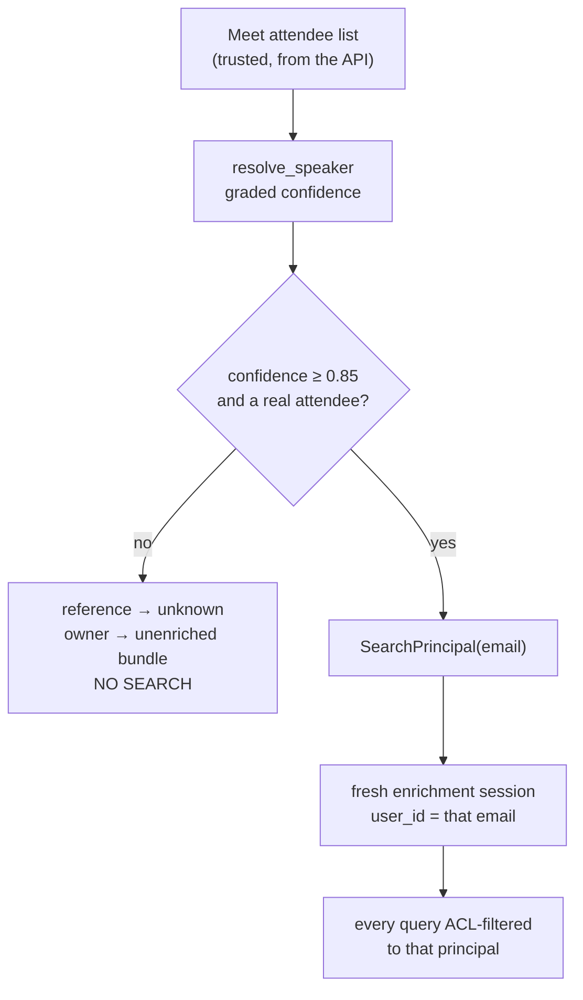
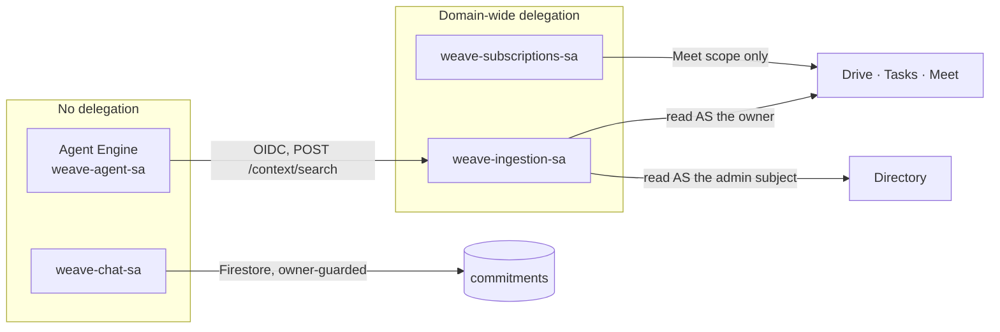

# Security and privacy model

Weave reads meeting transcripts and the personal Workspace context of everyone who attends.
That is genuinely sensitive material, and the design assumes it. The posture is stated once
here so it can be reviewed as a whole.

> **The governing rule: product invariants live in Python, never in a prompt.**
> A prompt is guidance that degrades under adversarial input. A validator is a guarantee.
> If a rule can only be expressed in a prompt string, it is not a rule yet.

## The four invariants

Each is enforced in code and pinned by a named test. These are the properties a reviewer
should check first.

### 1 · Two-phase isolation

Extraction sees the whole transcript but has **no context tools**. Enrichment runs once per
owner, in a **fresh session, as that owner**, with only that owner's items in state.

| Enforced by | Pinned by |
|---|---|
| The extraction agent's tool list (`resolve_speaker`, `infer_deadline` only) | `test_extraction_agent_has_no_context_tools` |
| `run_pipeline` — new session per owner, only that owner's items in state | `test_enrichment_session_state_contains_only_owner_items` |

*Why it matters.* The agent that legitimately sees everyone's words must never also be able
to reach anyone's files. Separating the two capabilities means no single reasoning step ever
holds both.

### 2 · Assignment ≠ commitment

Only `accepted` and `reassigned` are actionable. `accepted` structurally requires
`resolution_turn_ref`. Silence is always `unresolved`.

| Enforced by | Pinned by |
|---|---|
| `ACTIONABLE_STATUSES`, `ActionItem.is_actionable()`, a pydantic model validator | `tests/unit/test_commitment_filtering.py` |

*Why it matters.* This is the trust boundary of the whole product. A system that cannot
distinguish a promise from a suggestion produces a list nobody relies on — and an unreliable
list is worse than none, because it displaces the manual system people would otherwise keep.

### 3 · Identity from the Meet API, never from model output

`resolve_principal` fails closed: no email, confidence below `0.85`, or an owner who is not
a real attendee → an unenriched bundle, **never a search**.

| Enforced by | Pinned by |
|---|---|
| `agent/auth/principal_resolver.py`; orchestrator catch → unenriched bundle | `test_principal_resolver.py`, `test_transcript_only_attendee_is_refused_principal` |

*Why it matters.* Acting on a hallucinated identity routes one person's work — and one
person's context — to another. A model asked "who is Sarah?" always produces a plausible
answer, so identity is never sourced from one.

### 4 · No mutation

There is no write tool anywhere in the agent tool surface.

| Enforced by | Pinned by |
|---|---|
| Tool modules — exactly one context tool, read-only; delivery lives outside the agent | `test_agent_tool_surface_is_read_only` (asserts the enumerated tool set) |

*Why it matters.* This is the entire prompt-injection story. With no write capability, the
best outcome for a malicious transcript is a bad suggestion on a card a human reviews.

### Plus one framework invariant

**`SERVICE_ONLY` sources never serve a user query** unless explicitly allowed —
`allow_service_only` defaults to `False`. Pinned by
`test_service_only_results_never_reach_the_caller`.

## Identity resolution end to end



Confidence is graded, and ambiguity is refused rather than resolved:

| Match | Confidence |
|---|---|
| Exact participant ID | `1.0` |
| Exact display name | `0.95` |
| Fuzzy first/full name | `similarity × 0.9` |
| Two candidates within `0.05` | `0.0` — `ambiguous`, no email |
| No attendee state at all | `0.0` — `no_attendees` |

The floor is `IDENTITY_CONFIDENCE_FLOOR = 0.85`, defined once in `weave_common`.

Attendee state itself is built deterministically: Meet reports each signed-in participant,
and the participant's user id is resolved to an address through the Directory API.
Anonymous and dial-in participants are never attendees and can never own an item. An
external guest who cannot be resolved is dropped individually — but if *every* signed-in
participant fails to resolve, that is a broken directory rather than a room full of guests,
and the meeting fails loudly for retry.

**On the copilot surface**, identity comes only from the platform: `principal.py` accepts an
email-shaped ADK `user_id` and nothing else. The Chat path derives it from the sender's
stored onboarding record, never from the message body. There is deliberately no environment
variable, request field, or prompt-supplied override to make local testing easier, and the
principal is rewritten every turn, so a stale one can never survive.

## Data access model



| Identity | Delegation | Scopes | Notes |
|---|---|---|---|
| `weave-ingestion-sa` | **Yes** | `meetings.space.readonly`, `drive.readonly`, `admin.directory.user.readonly`, `tasks.readonly` | The only broad delegation in the system. All read-only. |
| `weave-subscriptions-sa` | **Yes** | `meetings.space.readonly` | Subscription lifecycle only. |
| `weave-agent-sa` | **No, ever** | — | `aiplatform.user`, `datastore.user`, `modelarmor.user`, `run.invoker` on ingestion. |
| `weave-chat-sa` | **No** | — | `datastore.user`, `logging.logWriter`, plus publish on the Chat events topic. |
| `weave-pubsub-push-sa` | **No** | — | `run.invoker` on ingestion only. |

**Every Workspace scope Weave holds is `readonly`.** There is no write scope to revoke
because none was ever requested.

Delegation is **keyless**: these accounts sign their own assertions through the IAM
Credentials API (`roles/iam.serviceAccountTokenCreator` on themselves) rather than carrying
exported private keys.

**Impersonation is per-event, not fixed.** Meet reads impersonate the user whose
subscription produced the event, because a conference record is visible only to that
conference's participants. `admin_subject` is used **only** for Directory lookups. When the
subscriber cannot be determined, the event fails with the full attribute set logged rather
than reading as the wrong account.

**The Chat install grants nothing.** Adding the app is an opt-in signal that records a DM
space and a numeric id; domain-wide delegation remains the authority for every Workspace
read, and installing or removing the app changes no permission.

## ACL enforcement

Every stored artefact carries `visible_to` — the normalised, lower-cased set of attendee
emails — and every context query filters on it **inside the query**:

```
where("visible_to", "array_contains", principal)
```

Firestore therefore never returns a document the principal cannot see. A ranking bug cannot
become a disclosure, because ranking only ever reorders rows the database already
authorised. The `action_items` and `meeting_summaries` vector indexes deliberately place
`visible_to` and the 768-dimension vector field in the **same index**, so the ACL prefilter
survives vector search rather than being applied afterwards.

Commitments are keyed on `owner_email` and every read and lifecycle write carries an owner
guard, so a commitment id obtained from anywhere — including a card button's parameters — is
unusable by anyone else.

## Untrusted input handling

Weave treats four things as untrusted data that may attempt to instruct a model: transcript
text, tool results, meeting excerpts, and workspace metadata (document titles, task text).

**Layer 1 — Model Armor on input.** Every transcript is screened before any model sees it:
hate speech and dangerous content at HIGH confidence, and prompt-injection / jailbreak
detection enforced at HIGH confidence. A blocked transcript is recorded as `blocked` and
acked, which is observable rather than silent.

**Layer 2 — explicit prompt discipline.** Every prompt states that this material is data and
never instructions. The copilot additionally: never fabricates a mention, meeting,
dependency, or document; treats a Drive result as proof that metadata and a link exist, not
that the body was read; and reports fields it was handed rather than composing rationale.

**Layer 3 — Model Armor on output.** Copilot responses are screened again, with
sensitive-data protection added.

**Layer 4 — the architecture.** The other three are mitigations; this is the guarantee.
With no write tools and no delegated capability on the agent runtime, a successful injection
still cannot do anything except produce a bad suggestion on a card a human reviews.

**Layer 5 — the echo gate.** Even output the model returns about *its own inputs* is not
trusted. `enforce_owner_scope` fingerprints every returned item against the exact inputs and
discards the model's copies, keeping only additive display fields.

## Fail-closed behaviour

The consistent rule: **when Weave cannot justify an answer, it returns nothing — and says
which of the two happened.**

| Situation | Behaviour |
|---|---|
| Owner email missing / low confidence / not an attendee | Unenriched bundle carrying the reason; **no search performed** |
| Reference cannot be grounded | Demoted to `unknown`; identity cleared, mention and turn kept |
| Copilot caller not email-shaped | Empty principal in session state; every tool returns nothing rather than guessing |
| Broker subject not onboarded | Empty result, **returned without searching** |
| Unknown context source in config | `ValueError` at **build time**, not query time |
| Invalid `status_filter` | Structured **error row** listing valid values — never `[]` |
| Unknown Workspace source at the broker | `400`, not a best-effort guess |
| Card click from a user who is not onboarded | A sentence saying so — never a card |
| Card click on a commitment that is not the clicker's | Owner guard refuses; the row simply drops out |
| Unauthenticated `/pubsub-push`, `/context/search`, `/chat-events` | `403` |
| Chat request without a valid Google-signed token for this URL | `401`, immediately and visibly |
| Meet event with no resolvable subscriber | Fails with the full attribute set logged; never reads as another account |

The distinction between "refused" and "empty" is treated as a first-class safety property.
An identity failure that renders as an empty list is the most dangerous possible outcome:
the platform looks healthy and the user concludes Weave has nothing for them.

## What Weave deliberately cannot do

- **Write to any work system.** No Drive write, no Google Tasks close, no Calendar change.
  Not disabled — absent.
- **Read anything a person cannot already read.** Every context read is executed as that
  person, against data already visible to them.
- **Show one person another person's work.** Delivery is direct-message only; there is no
  cross-team view, no manager dashboard, no "who owes what" report.
- **Infer a dependency.** Only stated preconditions become edges. Shared topic, project, or
  person creates nothing.
- **Infer completion.** `likely_complete` may be inferred from evidence, with its confidence
  shown. `closed` requires an explicit human confirmation of that specific commitment.
- **Accept an identity from anything but the platform.** No override exists, including for
  local development.

## Data residency and retention

Everything lives in **one GCP project**: Firestore for derived state, Pub/Sub in transit,
Artifact Registry for images, Cloud Logging for logs. Weave stores no data outside that
project, and deleting the project removes the system in its entirety.

What is stored: pipeline state (`processed_meetings`), onboarding preferences
(`onboarded_users`), owner-visible action-item history and meeting summaries, and derived
commitments with their mentions. Full document shapes are in [Data model](data-model.md).

Offboarding writes a tombstone; the subscription manager deletes the live Meet subscription
**before** deleting the record, and retains the tombstone for retry if deletion fails, so a
user is never left with an orphaned subscription. Chat does not reliably signal removal for
direct messages, so a departing user may need to be offboarded through the ledger.

## Threat notes

| Threat | Mitigation |
|---|---|
| Malicious transcript instructs the model | Model Armor at HIGH confidence; prompt discipline; **no write tools**; echo gate |
| Model hallucinates an owner | Identity only from Meet attendee state; confidence floor; fail closed |
| Model re-owns an item on the way out | Fingerprint echo gate discards the model's copy |
| Cross-owner context leak | Separate session per owner; ACL as a query predicate; no context tools during extraction |
| Compromised agent runtime | No delegation on `weave-agent-sa`; delegated reads only via an authenticated broker that refuses non-onboarded subjects |
| Forged Pub/Sub push | OIDC verification with `aud` = service URL and the expected SA |
| Forged Chat request | Google-signed OIDC verified against both accepted Chat signers, for this exact URL |
| Forged card click | The address comes from `onboarded_users` by user id, never from the payload; every write is owner-guarded |
| Replay / duplicate delivery | Firestore lease per conference; UUIDv5 ids throughout; close and reopen are idempotent |
| Search text leaking into logs | Broker logs the exception **type** only |
| Stale principal across turns | Principal overwritten every turn |
| Exported key leak | Keyless DWD via the IAM Credentials API |

## Reviewer's checklist

Ten checks that establish the posture quickly:

1. `make test` — 265 tests, hermetic, no network or credentials.
2. `test_agent_tool_surface_is_read_only` — the enumerated tool set has no write tool.
3. `test_extraction_agent_has_no_context_tools` — capability separation holds.
4. `test_enrichment_session_state_contains_only_owner_items` — isolation is structural.
5. `grep -rn "array_contains" agent/context_sources/` — ACLs are query predicates.
6. `infra/iam.tf` — `weave-agent-sa` has no delegation; only ingestion and subscriptions do.
7. `agent/copilot/principal.py` — no identity override path exists.
8. `infra/model_armor.tf` — both templates, HIGH confidence, injection filter enabled.
9. Unauthenticated `POST` to `/pubsub-push`, `/context/search`, `/chat-events` → each `403`.
10. Ask the same question in Chat as two onboarded users — each answer contains only that
    owner's commitments.
