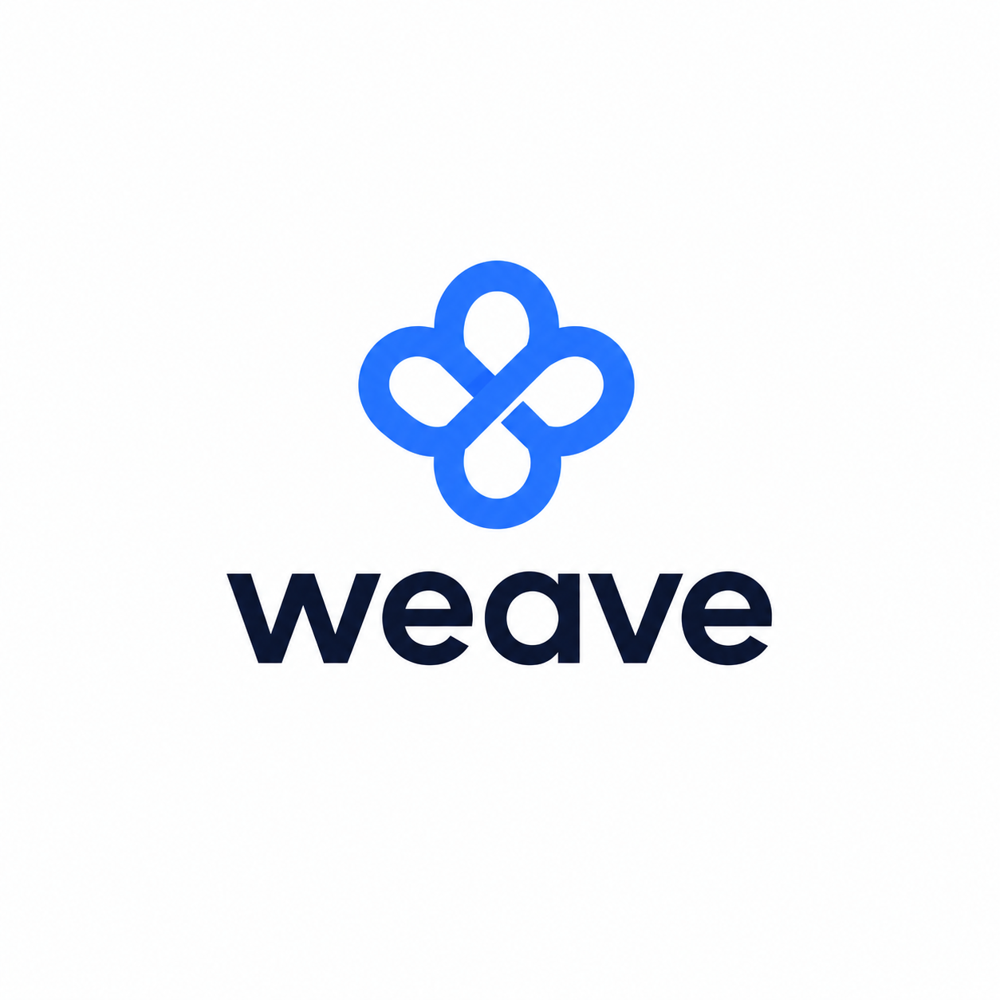

# Overview

  

## The problem

Knowledge work has quietly reorganised itself around the meeting. A senior engineer, a
product manager, a team lead — each now spends the majority of their week in calls, and
each call ends the same way: with a handful of half-formed obligations distributed across
the people who attended.

The tooling around that moment is worse than most people admit.

- **Meeting summaries answer the wrong question.** They tell you what was discussed. They
  do not tell you what *you* now owe, to whom, by when, or what has to happen first.
- **"Action items" are generated, not verified.** Every transcript tool will happily list
  "Alex to prepare the rollout checklist" — whether Alex agreed, refused, or said nothing
  at all. A list that cannot distinguish a promise from a suggestion is a list nobody
  trusts, and an untrusted list is not used.
- **Nothing survives across meetings.** The same deliverable is raised on the 12th,
  restated on the 19th, and carried over again on the 28th. Three tools produce three
  tasks. The one fact that matters — *this is the third week running* — is the one fact
  none of them holds.
- **So people track it by hand.** A sticky note, a doc they stopped updating, mostly
  memory. That system works until the week they have thirty items, and then the thing they
  drop is, reliably, the thing someone else was waiting on.

The failure is not that people forget. It is that the record of what they promised is
scattered across transcripts nobody re-reads, and the shape of the work — *what is blocking
what* — exists nowhere at all.

> **Work doesn't get lost in meetings. It gets lost after them.**

## The insight

Everything Weave does follows from one distinction:

> **An assignment is not a commitment.**

When Maya says *"Sarah, can you send the launch report by Friday?"*, nothing has been
promised yet. Four things can happen next, and they are not the same thing:

| What happens | Status | Becomes work? |
|---|---|---|
| *"Yes, I'll send it by Friday."* | `accepted` | **Yes** — with the accepting turn recorded as evidence |
| *"No, I can't take that this week."* | `declined` | No |
| *"Let's revisit next sprint."* | `deferred` | No |
| Responsibility moves, and the new owner accepts | `reassigned` | **Yes** — to the new owner |
| Nothing. The conversation moves on. | `unresolved` | **No — silence is never consent** |

Only `accepted` and `reassigned` become real work, and an `accepted` item is structurally
required to carry the turn index of the acceptance — the schema rejects one that does not.
That single rule is what makes the output trustworthy enough to act on without re-reading
the transcript, and it is enforced by a pydantic validator, not by asking a model nicely.

Everything else in Weave is built on top of that verified base: if the atoms are true, the
graph built from them can be trusted too.

## What Weave is

**An intelligent commitment ledger for people with too many meetings.**

It sits inside Google Workspace and does four things:

1. **Captures** every commitment from every meeting you attend, automatically, with no bot
   in the room and nothing to install beyond a Chat app you add yourself.
2. **Verifies** each one against the transcript — who agreed, in which turn, by when, and
   what they said had to happen first.
3. **Reconciles** repeated mentions into a single commitment with a history, and derives a
   dependency graph from preconditions people actually stated out loud.
4. **Answers**, in the same Google Chat direct message, *what should I do first, and why?*

## A day with Weave

**09:30 — the meeting ends.** Nobody did anything. Each attendee's own Meet transcript
subscription fires the moment their transcript is ready. Weave never joins the call.

**09:31 — extraction.** The transcript is screened by Model Armor, then read whole by a
Gemini agent that has *no access to any file, document, or search index*. It can do exactly
two things: resolve a speaker against the Meet attendee list, and interpret a spoken
deadline. It returns candidate action items with their commitment status, the turns that
prove it, resolved person-references, any stated precondition, and one structured meeting
summary.

**09:31 — verification and fan-out.** Non-actionable items are dropped and counted.
Person-references are re-grounded against the trusted Meet attendee list — anything the
model resolved that is not a real attendee is demoted to `unknown` rather than believed.
Each remaining owner is resolved to a search principal, and enrichment runs **once per
owner, in a fresh session, as that owner**.

**09:32 — enrichment.** Sarah's session sees only Sarah's items and can search only what
Sarah could already open: her prior action items, meeting summaries from meetings she
attended, her Drive files, her open Google Tasks. Each item gains a title, a short
explanation, and the handful of prior facts that still matter. Nobody's context can reach
anybody else's card, because the isolation is structural — a separate session with a
separate principal — not a prompt instruction.

**09:32 — reconciliation.** Each new mention is judged against that owner's open
commitments. *"Still owe you the launch report"* merges into the commitment raised two
weeks ago; the mention count becomes 3, the carry-over span becomes 16 days. A stated
precondition — *"I can't send it until the vendor numbers land"* — becomes a graph edge,
but **only** because someone said it. Two items sharing a topic never become a dependency.

**09:32 — delivery.** Sarah's card arrives in her Weave direct message, headed with the
meeting's agenda title and time, listing only her items, each with a **Mark done** button.
It says *Only visible to you*, and that is literally true.

**Later — the question that matters.** Sarah asks, in the same DM, *"what should I work on
first?"* and gets an answer with a reason attached:

> Confirm the rollback plan. It's 3 days overdue and three commitments are queued behind
> it — including Friday's launch report.

That ordering is arithmetic in shared code, not a mood the model was in. A missed promise
outweighs unblock impact; unblock impact outweighs everything else; only stated blockers
count as blockers. The card and the answer read the identical function, so they can never
disagree about the facts.

## Design principles

**Invariants belong in code.** A prompt is guidance and degrades under adversarial input; a
validator is a guarantee. Every safety property in this system is enforced in Python and
pinned by a named test. If a rule can only be expressed in a prompt string, it is not a
rule yet.

**Fail closed, and be legible about it.** Weave would rather return nothing than return
something it cannot justify. An owner whose identity resolves below the confidence floor
gets an unenriched bundle and no search at all. A click on a commitment that is not yours
gets a sentence, not a card. A meeting whose subscriber cannot be identified fails loudly
rather than being read as somebody else.

**Read-only, by construction.** There is no write path into Drive, Google Tasks, Calendar,
or any other work system — not disabled, absent. Weave's writes are confined to its own
derived state: pipeline records, onboarding, owner-visible history, and human-confirmed
lifecycle changes to its own commitments. This is also the whole prompt-injection story: a
malicious transcript's best case is a bad suggestion on a card a human reads.

**Degrade the component, never the meeting.** One owner's enrichment failure produces one
unenriched bundle. A failed embedding writes lexical history. An unreachable context source
returns no results from that source. A reconciliation failure is recorded on the meeting
and never blocks delivery. An unresolvable external guest is dropped; the meeting still
lands for everyone else. The blast radius of every failure is its own scope.

**Ambient, not another destination.** Weave has no app to open, no inbox to check, no tab
to keep. It lives in one Google Chat direct message that people already have open. Adding a
productivity tool that demands its own attention to solve a problem caused by too many
demands on attention would be self-defeating.

## What Weave is not

- **Not a meeting recorder.** No bot joins your calls. It reads the transcript Workspace
  already produced, after the fact.
- **Not a task manager.** It never creates or closes a Google Task, edits a Doc, or touches
  a calendar. It tells you what you owe; the doing stays wherever you already do it.
- **Not a summariser with extra steps.** Summaries are a by-product, retained because they
  are useful retrieval context. The product is the verified commitment graph.
- **Not a surveillance tool.** Every read is scoped to one person, executed as that person,
  against data they can already reach. There is no cross-team view, and no administrator
  dashboard of who owes what.

## Where to go next

- **[Scenarios](scenarios.md)** — where Weave changes the day, function by function.
- **[Features](features.md)** — the complete catalogue, each with the problem it solves.
- **[Architecture](../ARCHITECTURE.md)** — how the pieces fit together.
- **[Security model](../engineering/security.md)** — the invariants and how they are enforced.
- **[Roadmap](roadmap.md)** — per-user consent, smarter discovery, the source ecosystem, live mode.
